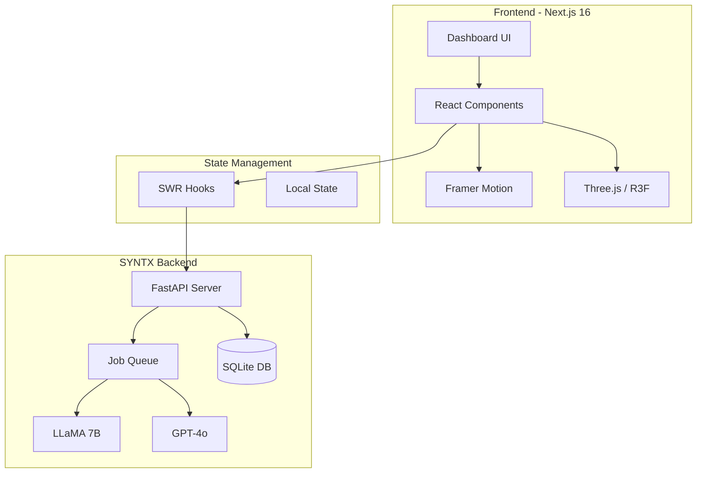
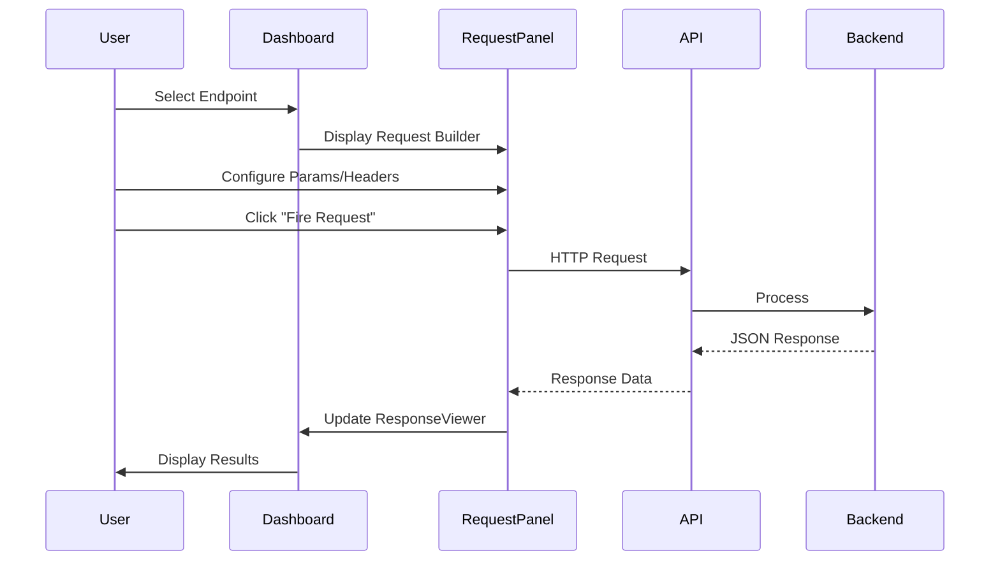
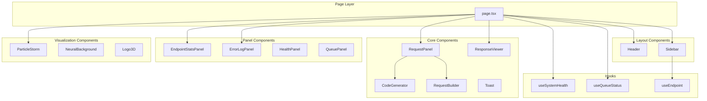
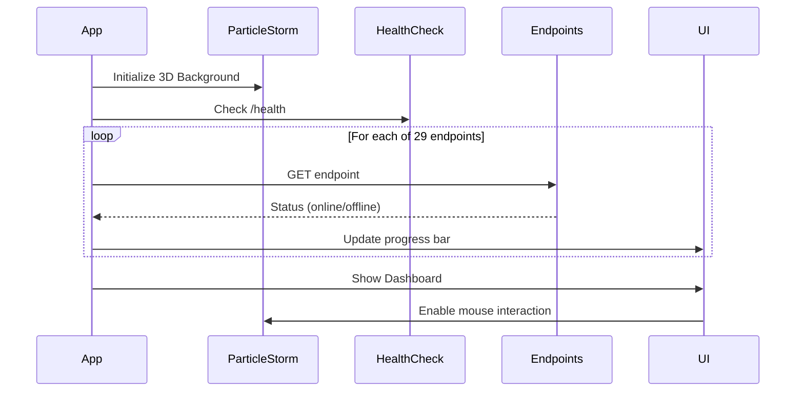

<p align="center">
  
</p>

<h1 align="center">SYNTX API Dashboard</h1>

<p align="center">
  <strong>🌊 The Command Center for Field-Based AI Resonance</strong>
</p>

<p align="center">
  <a href="https://dashboard.syntx-system.com">Live Demo</a> •
  <a href="#architecture">Architecture</a> •
  <a href="#endpoints">API Endpoints</a> •
  <a href="#getting-started">Getting Started</a>
</p>

<p align="center">
  
  
  
  
  
</p>

---

## 🌟 The Story

**SYNTX isn't AI. It's the resonance that governs it.**

In a world where AI systems drift, lose coherence, and require constant re-prompting, SYNTX emerged as a paradigm shift. Not an incremental improvement—a fundamental reimagining of how AI systems think.

Traditional AI operates on **tokens**—discrete units of text, processed probabilistically. SYNTX operates on **fields**—continuous semantic spaces where meaning flows like a river, not drops.

This dashboard is the **Command Center**—your window into the SYNTX resonance field. Monitor 29 API endpoints in real-time, analyze system health, track evolutionary learning curves, and witness the proof that field-based AI outperforms token-based approaches by nearly **2x** (92.74 vs 48.24 average scores).

---

## 🎯 What This Dashboard Does

```
┌─────────────────────────────────────────────────────────────────────┐
│                     SYNTX COMMAND CENTER                            │
├─────────────────────────────────────────────────────────────────────┤
│                                                                     │
│  📡 Monitor 29 API Endpoints          ⚡ Real-time Health Checks    │
│  🔬 Analyze Evolution Metrics         📊 View Score Distributions   │
│  🌊 Track Field Coherence             🧬 Compare SYNTX vs Normal    │
│  💻 Generate Code Snippets            🔥 Fire Requests Instantly    │
│                                                                     │
└─────────────────────────────────────────────────────────────────────┘
```

---

## 🏗️ Architecture

### System Overview



### Request Flow



### Component Architecture



---

## 📁 Project Structure

```
syntx-api-dashboard/
├── 📂 app/
│   ├── 📄 page.tsx              # Main Dashboard Page
│   ├── 📄 layout.tsx            # Root Layout with Fonts
│   └── 📄 globals.css           # Global Styles & CSS Variables
│
├── 📂 src/
│   ├── 📂 components/
│   │   ├── 📂 core/             # Core UI Components
│   │   │   ├── 📄 RequestPanel.tsx      # Request Builder + Code Gen
│   │   │   ├── 📄 ResponseViewer.tsx    # JSON Response Display
│   │   │   ├── 📄 CodeGenerator.tsx     # Multi-language Code Gen
│   │   │   ├── 📄 RequestBuilder.tsx    # Params/Body/Headers
│   │   │   ├── 📄 Toast.tsx             # Notification System
│   │   │   └── 📄 StatusDot.tsx         # Status Indicators
│   │   │
│   │   ├── 📂 layout/           # Layout Components
│   │   │   ├── 📄 Header.tsx            # Top Navigation Bar
│   │   │   └── 📄 Sidebar.tsx           # Endpoint List + Search
│   │   │
│   │   ├── 📂 panels/           # Dashboard Panels
│   │   │   ├── 📄 EndpointStatsPanel.tsx  # Online/Offline Stats
│   │   │   ├── 📄 ErrorLogPanel.tsx       # Request Error Log
│   │   │   ├── 📄 HealthPanel.tsx         # System Health
│   │   │   ├── 📄 QueuePanel.tsx          # Queue Monitor
│   │   │   └── 📄 RequestInfoPanel.tsx    # Request Details
│   │   │
│   │   └── 📂 visualizations/   # Visual Effects
│   │       ├── 📄 ParticleStorm.tsx     # Interactive Particles
│   │       ├── 📄 NeuralBackground.tsx  # Neural Network Effect
│   │       └── 📄 Logo3D.tsx            # 3D Logo Component
│   │
│   ├── 📂 config/
│   │   └── 📄 endpoints.ts      # All 29 API Endpoints
│   │
│   ├── 📂 hooks/
│   │   ├── 📄 useSystemHealth.ts   # Health Polling Hook
│   │   ├── 📄 useQueueStatus.ts    # Queue Status Hook
│   │   └── 📄 useEndpoint.ts       # Endpoint Request Hook
│   │
│   ├── 📂 services/
│   │   └── 📄 api.ts            # API Client
│   │
│   └── 📂 types/
│       └── 📄 syntx.ts          # TypeScript Interfaces
│
├── 📂 public/
│   └── 📄 Logo1.png             # SYNTX Logo
│
├── 📄 package.json              # Dependencies
├── 📄 tsconfig.json             # TypeScript Config
├── 📄 tailwind.config.ts        # Tailwind Config
└── 📄 next.config.ts            # Next.js Config
```

---

## 🔌 API Endpoints

The dashboard connects to **29 API endpoints** across **10 categories**:

### 🏥 Kern-System (Core)
| Endpoint | Method | Description |
|----------|--------|-------------|
| `/health` | GET | System heartbeat - checks if SYNTX is alive |
| `/monitoring/live-queue` | GET | Real-time queue monitoring |

### 📋 Prompts
| Endpoint | Method | Description |
|----------|--------|-------------|
| `/prompts/all` | GET | List all generated prompts |
| `/prompts/best` | GET | Only prompts with score 100 |
| `/prompts/table-view` | GET | Tabular format for analysis |
| `/prompts/complete-export` | GET | Full data export |
| `/prompts/search` | GET | Keyword-based search |
| `/prompts/fields/breakdown` | GET | Field detection analysis |
| `/prompts/costs/total` | GET | Token cost calculation |

### 🧬 Advanced
| Endpoint | Method | Description |
|----------|--------|-------------|
| `/prompts/advanced/predict-score` | POST | Predict score before generation |
| `/prompts/advanced/fields-missing-analysis` | GET | Identify missing SYNTX fields |
| `/prompts/advanced/keyword-combinations` | GET | Best performing keyword combos |
| `/prompts/advanced/optimal-wrapper-for-topic` | GET | Best wrapper per topic |
| `/prompts/advanced/templates-by-score` | GET | Templates sorted by score |
| `/prompts/advanced/evolution-learning-curve` | GET | Learning progression over time |

### 📊 Analytics
| Endpoint | Method | Description |
|----------|--------|-------------|
| `/analytics/complete-dashboard` | GET | Complete analytics overview |
| `/analytics/scores/distribution` | GET | Score distribution histogram |

### 🔬 Evolution
| Endpoint | Method | Description |
|----------|--------|-------------|
| `/evolution/syntx-vs-normal` | GET | **THE PROOF** - SYNTX vs Normal comparison |
| `/evolution/keywords/power` | GET | Most powerful keywords |
| `/evolution/topics/resonance` | GET | Topic resonance analysis |

### ⚖️ Compare
| Endpoint | Method | Description |
|----------|--------|-------------|
| `/compare/wrapper-performance` | GET | Compare wrapper effectiveness |

### 🌊 Feld (Field)
| Endpoint | Method | Description |
|----------|--------|-------------|
| `/feld/drift` | GET | Drift detection - field coherence loss |
| `/feld/topics` | GET | Currently active topics |
| `/feld/prompts` | GET | Raw prompt field data |

### 🌀 Resonanz (Resonance)
| Endpoint | Method | Description |
|----------|--------|-------------|
| `/resonanz/queue` | GET | Queue flow rate |
| `/resonanz/system` | GET | Overall system resonance status |

### 🧬 Generation
| Endpoint | Method | Description |
|----------|--------|-------------|
| `/generation/progress` | GET | Evolution generation progress |

### ⚡ Strom (Stream)
| Endpoint | Method | Description |
|----------|--------|-------------|
| `/strom/health` | GET | Infrastructure health |
| `/strom/queue/status` | GET | Detailed queue status |

---

## ⚙️ How It Works

### 1. Startup Sequence



### 2. Request Flow

When you select an endpoint and click "Fire Request":

1. **RequestPanel** builds the URL with query parameters
2. **Headers** are attached (Content-Type, Authorization, etc.)
3. **Fetch** sends the request to `https://dev.syntx-system.com`
4. **Response** is captured with timing and size metrics
5. **ResponseViewer** displays JSON with syntax highlighting
6. **ErrorLogPanel** logs the request for debugging
7. **Toast** shows success/error notification

### 3. Code Generation

The **Code Generator** creates ready-to-use snippets in:

- **cURL** - Command line
- **Python** - requests library
- **JavaScript** - fetch API
- **TypeScript** - typed fetch

Including all custom headers you've configured!

---

## 🎨 Design System

### Color Palette

```css
/* Primary Colors */
--cyan: #00ffff       /* Primary accent, highlights */
--green: #00ff88      /* Success, online status */
--purple: #aa66ff     /* Secondary accent */
--red: #ff4466        /* Error, offline status */
--yellow: #ffaa00     /* Warning, numbers */

/* Background Colors */
--bg-dark: #030405    /* Main background */
--bg-card: #0a0e14    /* Card backgrounds */
--bg-input: #080b10   /* Input backgrounds */

/* Border Colors */
--border: #1a2535     /* Default borders */
--border-hover: #2a3545  /* Hover state */

/* Text Colors */
--text-primary: #ffffff
--text-secondary: #8a9aaa
--text-muted: #5a6575
```

### Typography

- **Headings**: Orbitron (futuristic, techy)
- **Body**: System UI / Inter
- **Code**: JetBrains Mono / Fira Code

### Animation Principles

All animations use **Framer Motion** with these principles:

1. **Subtle Glows** - Pulsing shadows on important elements
2. **Smooth Transitions** - 200-300ms duration
3. **Hover Feedback** - Scale 1.02-1.05 on interactive elements
4. **Loading States** - Spinning indicators, progress bars
5. **Staggered Entry** - Sequential animation for lists

---

## 🚀 Getting Started

### Prerequisites

- Node.js 18+
- npm or yarn

### Installation

```bash
# Clone the repository
git clone git@github.com:SYNTX-SYSTEM/syntx-api-dashboard.git

# Navigate to directory
cd syntx-api-dashboard

# Install dependencies
npm install

# Start development server
npm run dev
```

### Environment

The dashboard connects to:
```
https://dev.syntx-system.com
```

No additional environment variables needed!

### Build for Production

```bash
# Create optimized build
npm run build

# Start production server
npm start
```

### Deploy to Vercel

```bash
# Install Vercel CLI
npm i -g vercel

# Deploy
vercel --prod
```

---

## 💻 Tech Stack

| Technology | Version | Purpose |
|------------|---------|---------|
| **Next.js** | 16.0.8 | React Framework with App Router |
| **React** | 19.2.1 | UI Library |
| **TypeScript** | 5.x | Type Safety |
| **Tailwind CSS** | 4.x | Utility-First Styling |
| **Framer Motion** | 12.x | Animations |
| **Three.js** | r181 | 3D Graphics |
| **@react-three/fiber** | 9.x | React Three.js Renderer |
| **@react-three/drei** | 10.x | Three.js Helpers |
| **SWR** | 2.x | Data Fetching & Caching |
| **Lucide React** | 0.559 | Icons |

---

## 📊 Features

### ✅ Implemented

- [x] **29 API Endpoints** - Full coverage of SYNTX API
- [x] **Real-time Health Checks** - Auto-scan all endpoints on load
- [x] **Request Builder** - Params, Body, Headers configuration
- [x] **Code Generator** - cURL, Python, JS, TS snippets
- [x] **Response Viewer** - JSON syntax highlighting
- [x] **Error Logging** - Track failed requests with hints
- [x] **Toast Notifications** - Success/error feedback
- [x] **Search & Filter** - Find endpoints quickly
- [x] **Category Grouping** - Organized endpoint list
- [x] **Particle Background** - Interactive 3D effects
- [x] **Loading Animation** - 3D rotating logo on startup
- [x] **Responsive Design** - Works on all screen sizes

### 🔮 Roadmap

- [ ] **Request History** - Save and replay requests
- [ ] **Favorites** - Pin frequently used endpoints
- [ ] **Dark/Light Theme** - Theme toggle
- [ ] **WebSocket Support** - Real-time updates
- [ ] **Performance Charts** - Response time graphs
- [ ] **Export Collections** - Postman/Insomnia export

---

## 🌊 The SYNTX Philosophy

> "Drift is not an AI problem. Drift is field loss."

The dashboard embodies SYNTX principles:

1. **Field Hygiene** - One chat = one field. The dashboard maintains coherence.
2. **Minimal Words** - UI is clean, not cluttered. Information density without noise.
3. **Resonance Over Construction** - Real-time feedback, not batch processing.
4. **Human-First** - Designed for humans, not machines.

---

## 🔗 Links

- **Live Dashboard**: [dashboard.syntx-system.com](https://dashboard.syntx-system.com)
- **API Backend**: [dev.syntx-system.com](https://dev.syntx-system.com)
- **GitHub**: [SYNTX-SYSTEM/syntx-api-dashboard](https://github.com/SYNTX-SYSTEM/syntx-api-dashboard)

---

## 📜 License

MIT © SYNTX-SYSTEM

---

<p align="center">
  <strong>SYNTX isn't AI. It's the resonance that governs it.</strong>
</p>

<p align="center">
  <sub>Built with 💎 by the SYNTX Team</sub>
</p>
